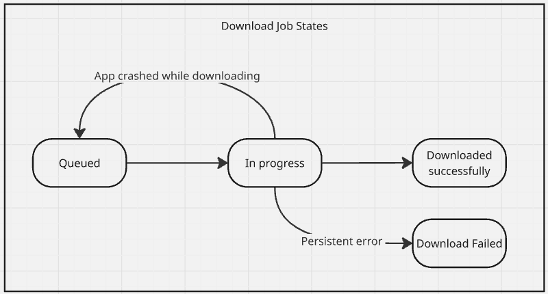
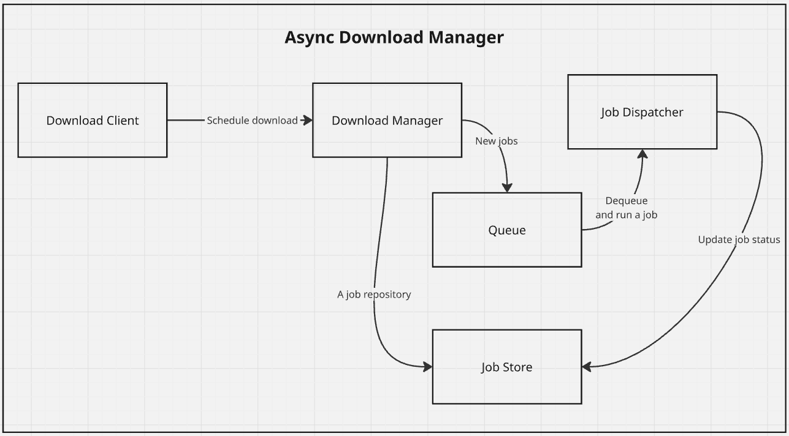

# Asynchronous Downloader

## Purpose

This is a reusable .NET class library for scheduling multiple HTTP downloads simultaneously. It can be installed into existing DI container or used alone.

## Job Lifecycle

A job lifecycle is outlined on a diagram below:

## Design

The library is organized as shown here:

Key parts of the library are [Job Dispatcher](./src/AsyncDownload.Backend/Implementation/JobDispatcher.cs) and [Download Manager](./src/AsyncDownload.Backend/Implementation/DownloadManager.cs). A memory store is used to keep all download requests (jobs), while the design allows implementations with persistence.

When `Download Manager` receives a request to download from some URL, it registers a new job and enqueues it so that `Job Dispatcher` can pick it up when a free download slot becomes available.

## Testing

Both unit and integration tests are provided as part of the project.

## Known Issues/Limitations

- No retries on transient network errors
- No persistence
- No CI/CD
- No GUI/command line